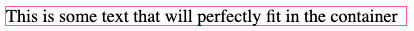
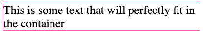

<h1 align="center">🫸 𝚛𝚎𝚊𝚌𝚝-𝚏𝚒𝚝𝚝𝚎𝚛 🫷</h1>

In a project of mine I had to fit some text of unknown length to a container
without it wrapping. This utility component does exactly that, regardless of
whether if it sits inline, in a flexbox, grid or table. It just works.

Demo: https://codesandbox.io/p/sandbox/swvf26

> [!IMPORTANT]
> 
> At the moment the fitter can have some issues adjusting to containers that
> resize based on their content. A feeback loop occurs where the fitter never
> settles because the size changes with every change in font size. I have some
> ideas on how to fix this but haven't tried implemented any them yet. If this
> is an issue for your use case, please don't hesitate to open an issue.

```bash
npm install react-fitter
```

Usage:
```jsx
import { Fitter } from 'react-fitter'

// ...

<div className="my-text">
  <Fitter>
    This is some text that will perfectly fit in the container
  </Fitter>
</div>
```

And your CSS can be whatever you want. The Fitter component will never make the
text larger than what's set by your styles. It will only ever make it smaller.
```css
.my-text {
  width: 400px;
  font-size: 24px;
  border: 1px solid hotpink;
}
```

Which would look like this:




In contrast to how it would look without react-fitter:



## `Fitter` component props

<!-- PROPS_TABLE_START -->
Prop name | Type | Default value | Description
--- | --- | --- | ---
`children` | `ReactNode` | (required) | The content to fit.
`minSize` | `number` | `0.25` | The minimum scale that the text will shrink to. E.g. 0.25 means the text will shrink to no less than 25% of its original size.
`maxLines` | `number` | `1` | The maximum number of lines that the text will shrink to fit.
`settlePrecision` | `number` | `0.01` | The precision at which the text will settle. The component finds the best size by halving the difference between the current size and the min/max size. If the difference is less than the settle precision, the component will stop and settle on that size. A value of 0.01 means the component will settle when the difference is less than 1%.
`updateOnSizeChange` | `boolean` | `true` | Whether to update the text size when the size of the component changes.
`resizeDebounceMs` | `number` | `50` | The time in milliseconds to wait before updating the text size when the size of the component changes. This is useful when the component is being resized frequently and you want to avoid updating the text size on every resize event.
<!-- PROPS_TABLE_END -->
